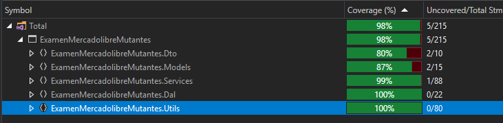
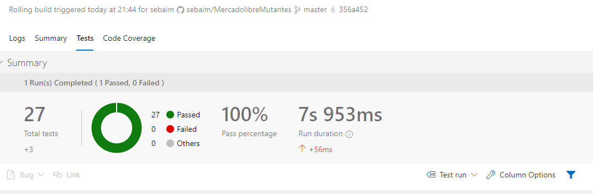
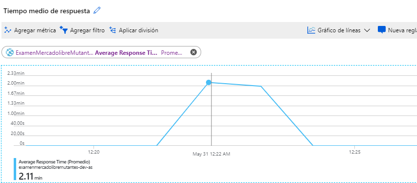
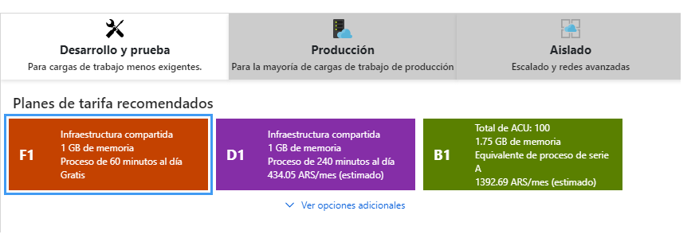

# MercadolibreMutantes

Technical Challenge to identify if provided dna belong to a mutants or not, and provide statistics about this.

## Technologies applied
* WebApi 2 with C# (.netCore)
* EntityFramework
* Swagger for API description
* Sql Database
* Azure Cloud Services with Azure DevOps Integration
* Nunit Framework
* Moq

## Assumptions
* Non NxN Matrix are not allowed (Api return error code 400)
* Matrix with invalid characters will not be taken into account for ratio calculation (Api will return error code 400)
* If same dna is analyzed more than one time, no extra row is created on table, but a counter will be incremented and will be taken into account on ratio calculation 

## Rest Service Test
````
URL: https://examenmercadolibremutantes-dev-as.azurewebsites.net
Services:
POST -> /mutant/
{
"dna":["ATGCGA","CAGTGC","TTATGT","AGAAGG","CCCCTA","TCACTG"]
}

GET -> stats
Response Example:
{"count_mutant_dna":40, "count_human_dna":100: "ratio":0.4}

````

## Way to test
* Using PostMan, ARC or similar using provide URL and Services
* Using Swagger tool included in proyect with follow URL :
````
https://examenmercadolibremutantes-dev-as.azurewebsites.net/swagger
````

## Instructions to compile and test Api
* Clone repository on visual studio with follow command
````
git clone https://github.com/sebaim/MercadolibreMutantes.git
````
* Run "Update-Database" command to create database used to log analysis results after change "DefaultConnection" value to local connection string
* Build and Run Application

## Unit Test
* It was done with Nunit3 Framework and Moq Framework to mock database access
* Code coverage was calculated with trial version of dotCover (from Resharper)
* It cover almost 100% of the code logic, and avoid to use database access class (DAL)

* It was also integrate with Azure DevOps on continuous integration


## Load Test
* A console was included on project, that allow to create multiple threads to create multiple request
* When request number is increased, the response time start to be higher than acceptable

* On this case, on a real scenario we should think about setup a server with more capacity (a non free one)

